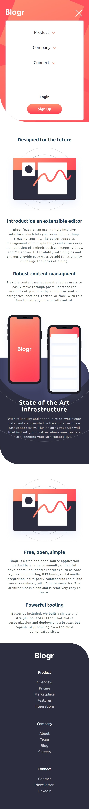
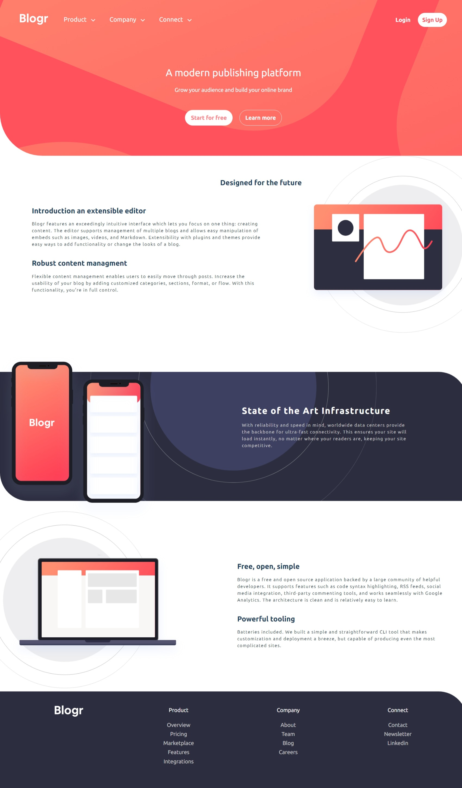

# Frontend Mentor - Blogr landing page solution

This is a solution to the [Blogr landing page challenge on Frontend Mentor](https://www.frontendmentor.io/challenges/blogr-landing-page-EX2RLAApP). Frontend Mentor challenges help you improve your coding skills by building realistic projects.

## Overview

### Screenshot

### Links

- Solution URL: [Solution URL](https://github.com/wojtekqwe/blogr_landing_page)
- Live Site URL: [Live Site URl](https://wojtekqwe.github.io/blogr_landing_page/)

## My process

### Built with

- HTML5
- SCSS
- Flexbox
- CSS Grid
- JavaScript
